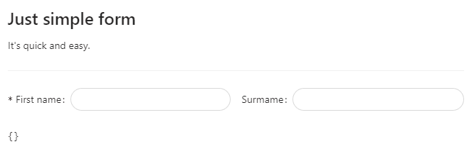

# Getting Started with Antd Form Manager Components

This project base on CRA and Ant.design to help you make a form manager quickly with some features

- [StoryBook](https://phamvietdung.github.io/antd-form-manager-components/)
- [NPM](https://www.npmjs.com/package/antd-form-manager-components)


## Available Scripts

In the your project directory, you can run:

#### `npm i antd-form-manager-components`

***

Once it install, let do some fun

#### Input 

```js

const simple_form = [
  {
    type: 'heading',
    label: <>
      <Title level={3}>Just simple form</Title>
      <Text>It's quick and easy.</Text>
      <Divider />
    </>,
    align: 'left'
  },
  {
    type: 'input',
    name: 'firstName',
    label: 'First name',
    required: true,
    span: 12
  },
  {
    type: 'input',
    name: 'surName',
    label: 'Surmame',
    required: false,
    span: 12
  },
]
```

#### Result



***

#### With custom validator

```js
const simple_form_validator = [
  {
    type: 'heading',
    label: <>
      <Title level={3}>Just simple form</Title>
      <Text>It's quick and easy.</Text>
      <Divider />
    </>,
    align: 'left'
  },
  {
    type: 'input',
    name: 'firstName',
    label: 'First name',
    required: true,
    span: 12,
  },
  {
    type: 'input',
    name: 'surName',
    label: 'Surmame',
    required: false,
    span: 12,
    validator: (values: any, current: any) => {
      if (values.firstName == current) return true;
      return false;
    },
    validatorMessage: "Oops!"
  },
]
```
#### And the result


***


#### Hide some thing ?

```js
const simple_form_visible = [
  {
    type: 'heading',
    label: <>
      <Title level={3}>Just simple form</Title>
      <Text>It's quick and easy.</Text>
      <Divider />
    </>,
    align: 'left'
  },
  {
    type: 'input',
    name: 'firstName',
    label: 'First name',
    // required: true,
    span: 8,
  },
  {
    type: 'input',
    name: 'surName',
    label: 'Surmame',
    required: false,
    span: 16,
    visible: (values: any) => {
      if (values.firstName == 'oops') return true;
      return false;
    }
  },
]
```

#### It's simple, yet

 
